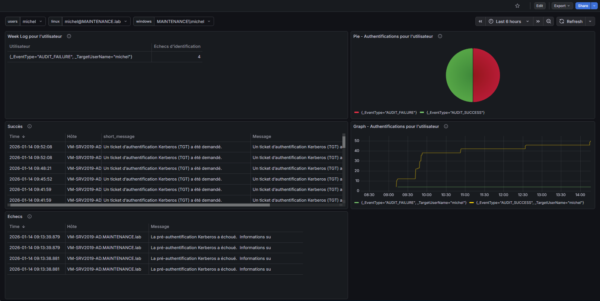
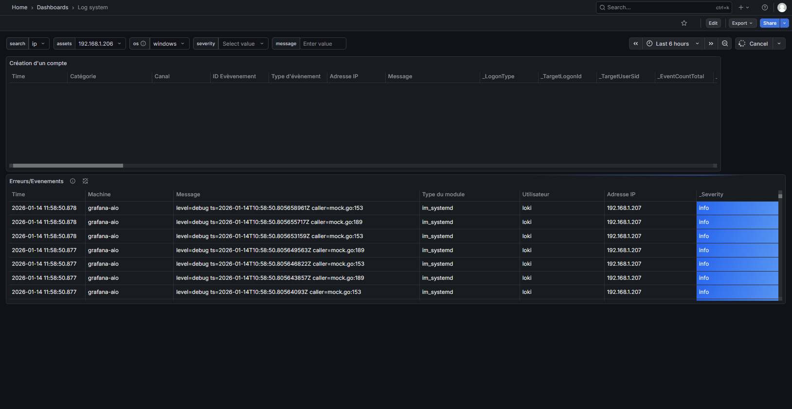
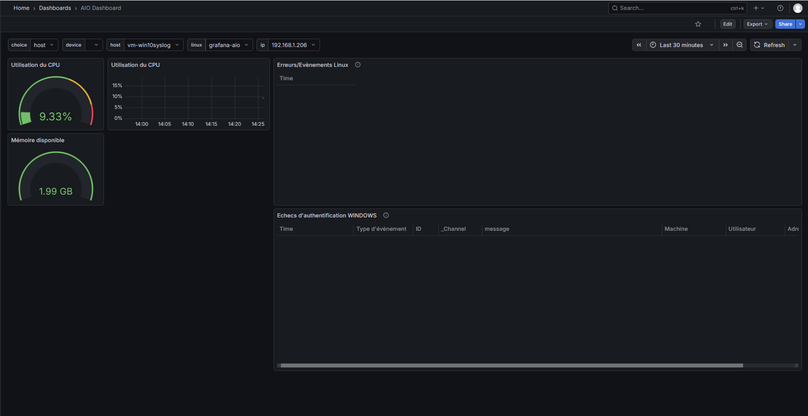
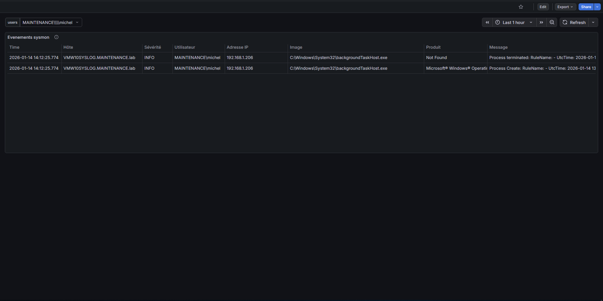

# Grafana Cross-Platform Log & Event Monitor

## Status
*Project in development (as of January 14 2026). Configurations and dashboards may evolve — be sure to have the latest version*

## Overview
**Grafana CPL & EM** provides centralized monitoring of Windows and Linux authentication events and system logs.  
It aggregates login activity, system events, error reports, and user‑management actions from both Windows and Linux systems.

## 📸 Screenshots

  

## 🎯 Key Features
- Real-time monitoring of authentication events and system errors  
- Automatic extraction of critical fields:
  - User, source workstation, event type, timestamp  
- Multiple dashboards tailored for specific use cases  
- Intuitive Grafana visualizations (tables, time series, charts)  
- Lightweight architecture using NXLog + Alloy
- Receive notifications by email

## 🏗️ Architecture
**Flow:** Windows/Linux → NXLog → Alloy (Grafana Agent) → Loki → Grafana  

**Components:**
1. **NXLog** – Collects Windows/Linux logs  
2. **Alloy (Grafana Agent)** – Syslog reception & parsing  
3. **Loki** – Structured log storage  
4. **Grafana** – Visualization & dashboards  

> Configuration files are in the `configs` folder. Update IP/PORT values as needed. Dashboards are in the `dashboard` folder.

## 📈 Dashboards
### 1. Login Monitor
- Tracks successful and failed login attempts from multiple sources, including SSH and RDP
- Can also monitor Active Directory users that tried to logon 
- Data is shown in table, charts for easy reading
- Usage of variable to select the correct user

### 2. System Error Monitor
- Displays Linux and Windows system errors  
- Sources: Windows Event Viewer, Linux systemd logs  

### 3. Unified Events & Errors Dashboard
- Consolidates authentication events and system errors in one view  
- Uses **business inputs** and dynamic variables (hostname, IP)  
- Enables flexible, dynamic filtering across the infrastructure

### 4. Sysmon Dashboard
- Shows sysmon events as they appear in the event monitor on Windows

### 5. AIO Dashboard
- Use of Prometheus and Windows_Exporter to show status about RAM and CPU.
- The goal of these dashboards is to monitor logs, so this one is just for information

## Log Ingestion (GELF)
**GELF (Graylog Extended Log Format)** ensures structured, efficient log collection.  

- **Pipeline:** Logs → GELF listener → Observability stack  
- **Advantages:**
  - JSON-based structured data (easy parsing & querying)  
  - Compression support for bandwidth efficiency  
  - Extensible with custom fields (`_field`) for context  

## Installation with Ansible

Two other repositories were created. `ansible-nxlog-windows` and `ansible-nxlog-linux`. 
Each repository contains a playbook that can
install NXLog and copy the correct configuration. 

All instructions are specified in the `README.MD` of each repository. 
The playbook can be executed with no need of Internet access, because all of the files are in the `files` folder.

## Installation with scripts
You can also install NXLog and copy the configuration by using the provided scripts. For Windows, you can use the PowerShell script `install-windows.ps1` and for Linux based systems `install-linux.sh`. 

The script will do the same stuff as Ansible, however, the machine needs to be connected to Internet because the repository will be cloned to get the different files. 

**Make sure to change the IP addresses in the NXLog configuration file after installation and restart the service!**